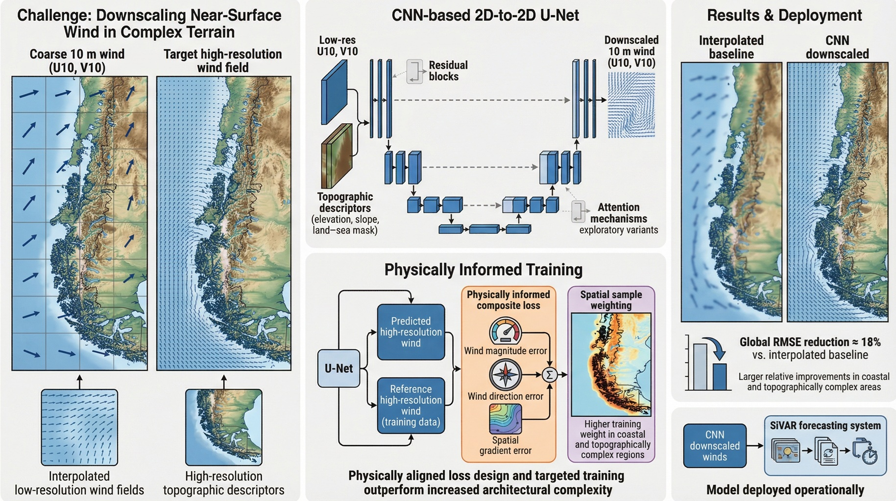

# 🌬️ U-Net Wind Downscaling for Complex Coastal Terrain in Southern Chile

<p align="center">
  
</p>

> **A deep learning framework for downscaling 3 km WRF forecasts to 333 m near-surface wind fields over southern Chile's fjord-dominated coastal domain.**

---

## 📖 About

Accurate wind forecasting in complex terrain is limited by the coarse resolution of numerical weather prediction (NWP) models. This work presents a **2D-to-2D U-Net** trained as a high-resolution WRF emulator to downscale 10-m wind components (*U*, *V*) from **3 km WRF forecasts** to **~333 m resolution** over a highly complex coastal–insular domain in southern Chile.

The model takes as input:
- 🌀 Bicubically interpolated low-resolution wind fields (*U10*, *V10*)
- 🏔️ 29 high-resolution topographic descriptors (elevation, slope, aspect, flow-deflection indices)

Training is guided by a **physically constrained composite loss** that jointly penalizes errors in wind speed, direction, and spatial gradients, combined with **coastal-mask spatial weighting** to prioritize complex terrain regions.

### ✨ Key Results

| Metric | Value |
|---|---|
| Global RMSE reduction | **~18%** vs. bicubic baseline |
| Vector RMSE improvement | **17.75%** |
| Coastal / high-topography zones | **>22%** improvement |
| Spatiotemporal coherence (*r* ≥ 0.8) | **93%** of domain |

> The framework is **operationally deployed** in the SiVAR forecasting system, providing high-resolution wind fields for environmental and maritime applications.

---

## 📁 Repository Structure
## 📓 Run the demo notebook

### Running the Demo

All commands should be executed from within the `demo/` directory.

**1. Generate a prediction**

```bash
conda env create -f env_unetpred.yml
conda activate env_test
python unet_prediction.py
```

Run the prediction script:

```bash
python unet_prediction.py
```

This will take a sample input tensor corresponding to a pair of low-resolution simulation hours and generate a prediction. The output file will be saved in the same directory.

**2. Exploring the Results**

Create and activate the plotting environment:

```bash
conda env create -f unet_plot.yml
conda activate unet_plot
```

> ⚠️ Make sure unet_prediction.py has run successfully before proceeding.

Open plot.ipynb and use the plot_pred_vs_target function to explore and compare the different model outputs.

## 📄 Citation
## 📬 Contact

